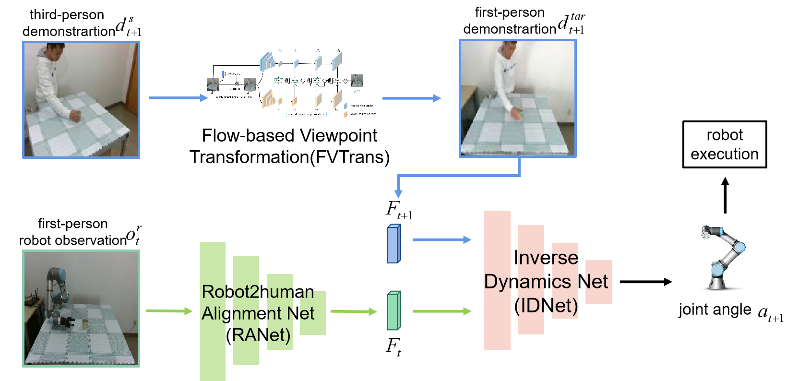

## Overview

The framework is proposed to enable robots to perform new tasks by watching human demonstration videos from an unconstrained third-person viewpoint. First, FVTrans in our framework transforms the unseen third-person human demonstration from the source context into the first-person demonstration. Then, RANet aligns the features from robot observation to those from human demonstration. Finally, with the feature of the next moment and the feature of the current moment as input, inverse dynamics network(IDNet) predicts robot joint angles as the imitative action.
　
 

----

## Videos

		<video  height="80%" width="100%" controls>
		  <source src="./video/video.mp4" type="video/mp4">
		</video>

	

 
----

## Code & Dataset

The code and data will be released soon!
 

